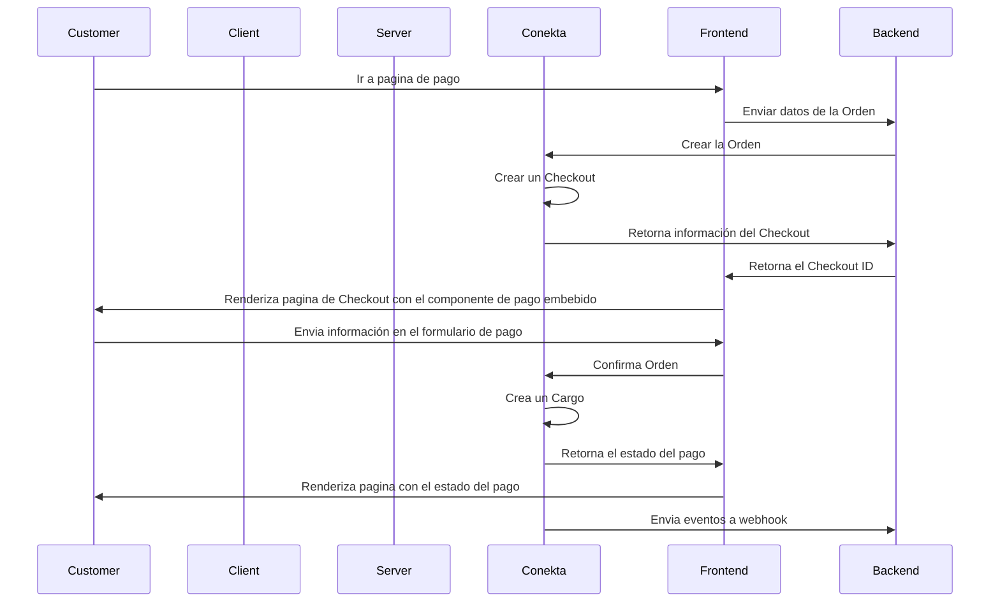

# Cobra con Componente de Pago

Puedes construir un flujo de pagos personalizado embebiendo el componente de pago de Conekta, el cual permite aceptar todos los metodos de pagos usando una sola integración.




## Configurar Conekta.
[Registrate](https://panel.conekta.com) en Conekta y genera tus llaves secretas para autenticar tus API Requests. Para el desarrollo de tus servicios necesitaras la llave privada

## Crea una Order

Agrega un boton en tu sitio web que ejecute un llamado al API de Conekta desde tu servidor para crear una Order.

```html
<html>
	<head>
		<title>Buy cool new product</title>
	</head>   
	<body>
		<form action="/checkout" method="POST">
			<button type="submit">Pagar con Conekta</button>
		</form>   
	</body>
</html>
```

El objeto Order representa la intención de compra de tu cliente. Incluye todos los detalles relacionados a ella, como metodos de pago, información de envio, lista de productos a comprar, cargos, descuentos, impuesto, etc.

La Order requiere información del cliente (Objeto Customer). El objeto Customer representa un cliente de tu negocio. Permite crear cargos recurrentes y hacer un seguimiento de los pagos que pertenecen al mismo.

Puedes crear un nuevo Customer o reutilizar la información de un Customer creado previamente.

```python
import conekta
import uvicorn
from pathlib import Path
from fastapi import FastAPI, Request, APIRouter
from fastapi.templating import Jinja2Templates

BASE_PATH = Path(__file__).resolve().parent
templates = Jinja2Templates(directory=str(BASE_PATH / "public"))

router = APIRouter()
app = FastAPI()
conekta.api_key = ""
conekta.locale = "es"


@router.get("/")
async def return_ecommerce(request: Request):
    return templates.TemplateResponse("button.html", {"request": request})

@router.post("/checkout")
async def create_checkout(request: Request):

    # Creación de Customer
    customer = conekta.Customer.create(
        {
            "name": "Miguel Cuartin",
            "email": "miguel.cuartin@conekta.com"
        }
    )

    # Creacion de una Orden
    order = conekta.Order.create(
        {
            "currency": "MXN",
            "customer_info": {
                "customer_id": customer["id"]
            },
            "line_items": [
                {
                    "name": "Nintendo Switch OLED",
                    "unit_price": 9000000,
                    "quantity": 3
                }
            ],
            "checkout": {
                "type": "HostedPayment",
                "allowed_payment_methods": ["cash", "card", "bank_transfer"],
                "success_url": "https://www.github.com/macuartin",
                "failure_url": "https://www.twitter.com/macuartin",
            },
	    }
    )
    # Obtener el Checkout ID
    checkout_id = order["checkout"]["id"]
    # Envia el Checkout ID al template HTML a renderizar para inicializar el componente de pago.
    return templates.TemplateResponse("index.html", {"request": request, "checkout_id": checkout_id})

app.include_router(router)

if __name__ == "__main__":
    uvicorn.run(app, host="0.0.0.0", port=8000)
```

Una vez creada la Order deberas obtener el ID del Checkout asociado a la Order y con el inicializar el componente de pago embebido en tu pagina de Checkout.

```html
<!DOCTYPE html>
<html>
    <head>
        <meta charset="utf-8">
        <title>Checkout</title>
        <script type="text/javascript" src="https://pay.conekta.com/v1.0/js/conekta-checkout.min.js"></script>
    </head>
    <body>
    <div id="conektaIframeContainer" style="height: 700px;"></div>
        <script type="text/javascript">
        window.ConektaCheckoutComponents.Integration({
            targetIFrame: "#conektaIframeContainer",
            checkoutRequestId: "{{ checkout_id }}", //Checkout ID enviado desde el servidor para inicializar el componente de pago.
            publicKey: "key_DZF6WRHRTawkXXkRYCilBEm",
            options: {},
            styles: {},
            onFinalizePayment: function(event){
                console.log(event);
            }
        })
        </script>
    </body>
</html>
```

Con el componente de pago inicializado en la pagina de Checkout de tu tienda, tu cliente solo debera seleccionar el metodo de pago y seguir las instrucciones para concretar la compra.

Para finalizar, una vez confirmado el pago por parte de tu cliente, se generara un evento `onFinalizePayment` el cual te retornara la información de la orden y el cargo. Ademas se ejecutara la redirección a tu pagina de pago exitoso o error segun aplique.

```json
{
    "id": "ord_2sx2A7rvbgMsdM4wj",
    "reference": "646180111812345678",
    "urlRedirect": "https://www.github.com/macuartin?checkout_id=73092185-08e7-4eb8-a7ce-6589783fddd0&order_id=ord_2sx2A7rvbgMsdM4wj&payment_status=pending_payment",
    "charge": {
        "id": "638a7f5239bb3a002322cdf1",
        "currency": "MXN",
        "payment_method": {
            "type": "spei"
        },
        "status": "pending_payment",
        "customer_id": "",
        "order_id": "ord_2sx2A7rvbgMsdM4wj"
    },
    "metaData": {}
}
```
## Capturar eventos del pago.

Conekta permite automatizar acciones enviando eventos en respuesta a las transiciones que se producen en el flujo de pagos. Para recibir estos eventos y ejecutar acciones siga la guía de [webhooks](pagos/after-payments/handling-payment-events).

Se recomienda capturar los siguientes eventos cuando cobre pagos con el checkout:

|Evento|Descripción|
|---|---|
|order.paid |Enviado cuando un cliente completa un pago de forma exitosa|
|order.pending_payment|Enviado cuando una orden es creada pero continua pendiente de pagar|
|order.declined|Enviado cuando el pago de una orden es declinado|

Al capturar estos eventos podras tomar acciones post-venta como:
* Ejecutar un flujo de logistica.
* Actualizar tus bases de datos de ordenes.
* Actualizar tus sistemas contables.