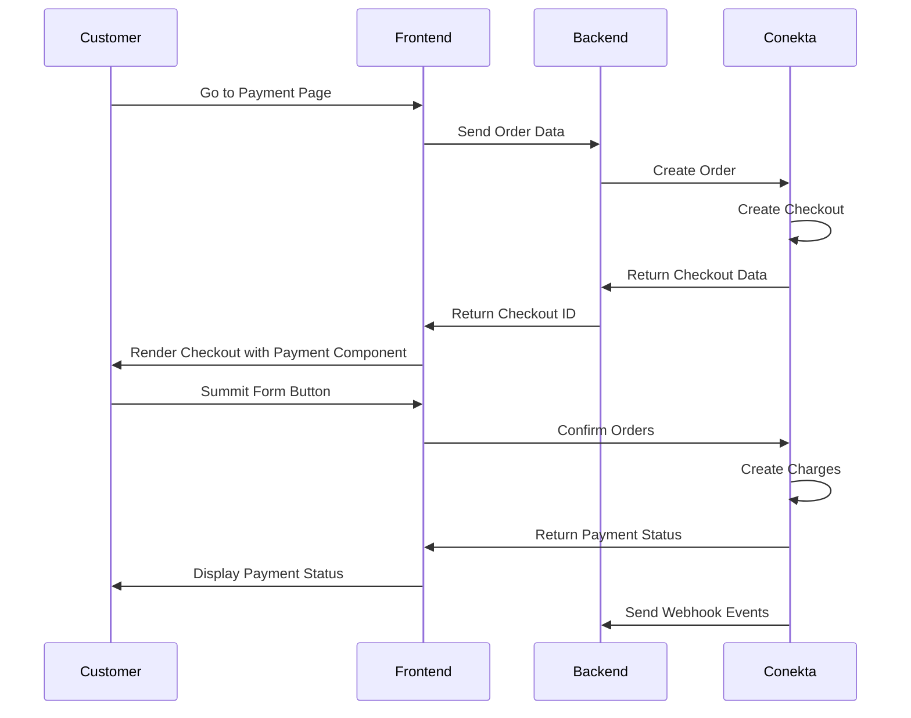

# Cobra con Componente de Pago

Puedes construir un flujo de pagos personalizado embebiendo el componente de pago de Conekta, el cual permite aceptar todos los metodos de pagos usando una sola integración.




## Configurar Conekta.
[Registrate](https://panel.conekta.com) en Conekta y genera tus llaves secretas para autenticar tus API Requests. Para el desarrollo de tus servicios necesitaras la llave privada

## Crea una Order

El objeto Order representa la intención de compra de tu cliente. Incluye todos los detalles relacionados a ella, como metodos de pago, información de envio, lista de productos a comprar, cargos, descuentos, impuesto, etc.

La Order requiere información del cliente (Objeto Customer). El objeto Customer representa un cliente de tu negocio. Permite crear cargos recurrentes y hacer un seguimiento de los pagos que pertenecen al mismo.

Puedes crear un nuevo Customer o reutilizar la información de un Customer creado previamente.

```python
import conekta
import uvicorn
from fastapi import FastAPI, Request, APIRouter
from fastapi.responses import RedirectResponse

router = APIRouter()
app = FastAPI()
conekta.api_key = ""
conekta.locale = "es"

@router.post("/checkout")
async def create_checkout(request: Request):

    customer = conekta.Customer.create(
        {
            "name": "Miguel Cuartin",
            "email": "miguel.cuartin@conekta.com"
        }
    )

    order = conekta.Order.create(
        {
            "currency": "MXN",
            "customer_info": {
                "customer_id": customer["id"]
            },
            "line_items": [
                {
                    "name": "Nintendo Switch OLED",
                    "unit_price": 15000000,
                    "quantity": 3
                }
            ],
            "checkout": {
                "type": "Integration",
                "allowed_payment_methods": ["cash", "card", "bank_transfer"],
                "on_demand_enabled": True
            },
	    }
    )
    url = order["checkout"]["url"]
    return RedirectResponse(url)


@router.get("/")
async def get_status():
    return {"Status": "OK",}

app.include_router(router)

if __name__ == "__main__":
    uvicorn.run(app, host="0.0.0.0", port=8000)
```

## Capturar eventos del pago.

Conekta permite automatizar acciones enviando eventos en respuesta a las transiciones que se producen en el flujo de pagos. Para recibir estos eventos y ejecutar acciones siga la guía de [webhooks](pagos/after-payments/handling-payment-events).

Se recomienda capturar los siguientes eventos cuando cobre pagos con el checkout:

|Evento|Descripción|
|---|---|
|order.paid |Enviado cuando un cliente completa un pago de forma exitosa|
|order.pending_payment|Enviado cuando una orden es creada pero continua pendiente de pagar|
|order.declined|Enviado cuando el pago de una orden es declinado|

Al capturar estos eventos podras tomar acciones post-venta como:
* Ejecutar un flujo de logistica.
* Actualizar tus bases de datos de ordenes.
* Actualizar tus sistemas contables.